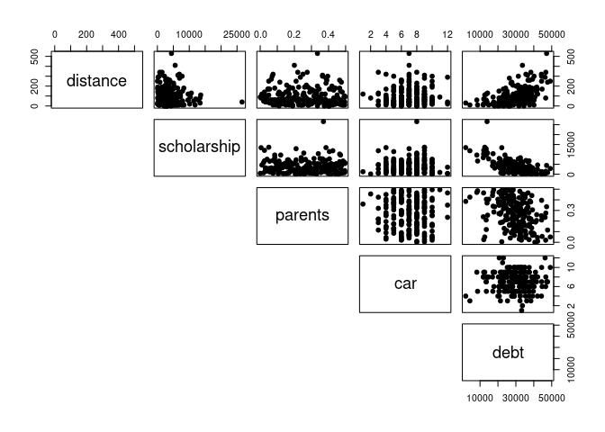
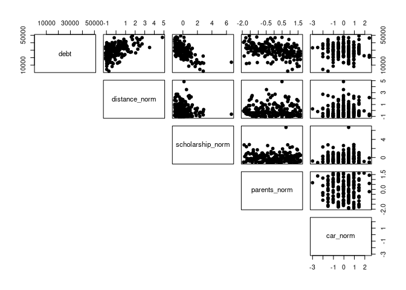

Activity 5 - Mini-competition Explorations
================

``` r
library(tidyverse)
```

    ## ── Attaching packages ─────────────────────────────────────── tidyverse 1.3.2 ──
    ## ✔ ggplot2 3.3.6     ✔ purrr   0.3.4
    ## ✔ tibble  3.1.8     ✔ dplyr   1.0.9
    ## ✔ tidyr   1.2.0     ✔ stringr 1.5.0
    ## ✔ readr   2.1.2     ✔ forcats 0.5.2
    ## ── Conflicts ────────────────────────────────────────── tidyverse_conflicts() ──
    ## ✖ dplyr::filter() masks stats::filter()
    ## ✖ dplyr::lag()    masks stats::lag()

``` r
library(tidymodels)
```

    ## ── Attaching packages ────────────────────────────────────── tidymodels 1.0.0 ──
    ## ✔ broom        1.0.1     ✔ rsample      1.1.0
    ## ✔ dials        1.0.0     ✔ tune         1.0.0
    ## ✔ infer        1.0.3     ✔ workflows    1.0.0
    ## ✔ modeldata    1.0.0     ✔ workflowsets 1.0.0
    ## ✔ parsnip      1.0.1     ✔ yardstick    1.0.0
    ## ✔ recipes      1.0.1     
    ## ── Conflicts ───────────────────────────────────────── tidymodels_conflicts() ──
    ## ✖ scales::discard() masks purrr::discard()
    ## ✖ dplyr::filter()   masks stats::filter()
    ## ✖ recipes::fixed()  masks stringr::fixed()
    ## ✖ dplyr::lag()      masks stats::lag()
    ## ✖ yardstick::spec() masks readr::spec()
    ## ✖ recipes::step()   masks stats::step()
    ## • Use suppressPackageStartupMessages() to eliminate package startup messages

# Loading data

``` r
data <- read_csv('data/allendale-students.csv');
```

    ## Rows: 200 Columns: 7
    ## ── Column specification ────────────────────────────────────────────────────────
    ## Delimiter: ","
    ## chr (2): housing, major
    ## dbl (5): distance, scholarship, parents, car, debt
    ## 
    ## ℹ Use `spec()` to retrieve the full column specification for this data.
    ## ℹ Specify the column types or set `show_col_types = FALSE` to quiet this message.

``` r
head(data)
```

    ## # A tibble: 6 × 7
    ##   distance scholarship parents   car housing    major     debt
    ##      <dbl>       <dbl>   <dbl> <dbl> <chr>      <chr>    <dbl>
    ## 1       40        1532   0.44      6 off campus STEM     26389
    ## 2       30        7479   0.265     7 on campus  STEM     21268
    ## 3      130        2664   0.115     3 on campus  business 32312
    ## 4      120        1998   0.325     9 on campus  business 28539
    ## 5       30        1462   0.105    10 off campus other    34867
    ## 6        0        3053   0.335     9 off campus STEM     18193

## Coding non-numeric variables

``` r
# Taking off-campus as 0 and on-campus as 1
data <- data %>% mutate(housing_coded = if_else(housing == 'off campus', 0, 1))

# Taking major other=0, business=1, STEM=2
data <- data %>% mutate(major_coded = if_else(major == 'other', 0, if_else(major == 'business', 1, 2)))
```

## Scatter plot matrix (without normalisation)

``` r
pairs(data[,c(1,2,3,4,7)], pch = 19, lower.panel = NULL)
```

<!-- -->
\#\# Normalization with standard scaling

``` r
data <- data %>% mutate(distance_norm = scale(data$distance)) %>%
  mutate(scholarship_norm = scale(data$scholarship)) %>%
  mutate(parents_norm = scale(data$parents)) %>%
  mutate(car_norm = scale(data$car))
```

## Scatter plot matrix (with normalisation)

``` r
pairs(data[,c(7,10,11,12,13)], pch = 19, lower.panel = NULL)
```

<!-- -->
